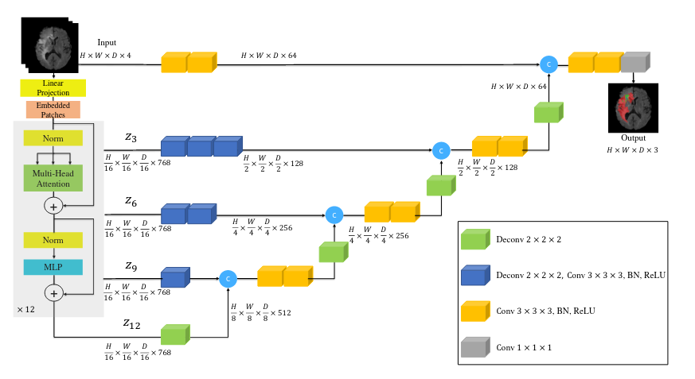

# BraTS_2021

Our implementation of the BraTS 2021 challenge.

```
The Brain Tumor Segmentation (BraTS) challenge celebrates its 10th anniversary, and this year is jointly organized by the Radiological Society of North America (RSNA), the American Society of Neuroradiology (ASNR), and the Medical Image Computing and Computer Assisted Interventions (MICCAI) society.

The RSNA-ASNR-MICCAI BraTS 2021 challenge utilizes multi-institutional pre-operative baseline multi-parametric magnetic resonance imaging (mpMRI) scans, and focuses on the evaluation of state-of-the-art methods for (Task 1) the segmentation of intrinsically heterogeneous brain glioblastoma sub-regions in mpMRI scans. Furthemore, this BraTS 2021 challenge also focuses on the evaluation of (Task 2) classification methods to predict the MGMT promoter methylation status.
```

## Architecture :
```
├── data                            # BraTS dataset from kaggle
│   ├── train                       # 586 samples
│       ├── FLAIR                   # describe FLAIR
│           ├── yyyyyy              # index of individual 
│               ├── Image-xxx.dcm   # dcm images
│       ├── T1w                     # describe
│       ├── T1wCE                   # describe
│       ├── T2w                     # describe
│   ├── test                        # only available on Arthur"s computer
│   ├── train_labels.csv            # only available on Arthur"s computer
│   ├── sample_submission.csv       # only available on Arthur"s computer
├── dataset						    # Files to process data, dataset loaders
├── experiments 				    # checkpoints and results of trainig
│   ├── name_of_experiment
├── agents                          # network agents
│   ├── baseline.py                     # defines model,dataloader, loss, optimizer...
├── config 
│   ├── name.yaml                   # parameters for runx experiment
├── graphs 
│   ├── models                      # actual model codes used in agents
│       ├── baseline.py
│   ├── loss                        # loss functions and their implementation
├── pretrained_weights
├── utils                           # utility files for measure, runx etc
├── main.py                         # main used to launch 
├── run.sh                          # run experiment (using runx)

```
### The agent
The agent controls the training and evaluation process of your model and is considered the core of the project.


## To Do List 

### 27 July

* Try to understand the problem, is it a binary classification problem or image segmentation ? **Done**
* Try to understand the input **Done**
* One model per tool -> then maybe agregate the results ?
* One model per tool -> one submission per tool
* Dataloader in pytorch to load dcm images / normalize input (256 pixels) **Done**
* Learnable data normalization

### 28 July

#### Approaches that we can try:

* Baseline : Resnet (binary Classification) using one tool

### 29 July

* RNN with vec size 500 -> arthur will do this man
* Understand how to deal with video data with arbitrary variable number of frames

### 30 July

* Point cloud
* KP Conv
* voxel

### Baselines

* Mean image + Resnet / Efficientnet. According to kaggle discussions, Efficientnet is doing crazy on this dataset
* 3d-CNN (according to kaggle)
* 3d Efficientnet
* Autoencoder + k-NN??
* Adversarial training
* Use external modalities (orientation of the image)


Articles to read : 
#### UNETR: Transformers for 3D Medical Image Segmentation, [source](https://arxiv.org/pdf/2103.10504v1.pdf)

We can leverage this idea for our case since they are dealing with sequential data as well. They are using 3d transformers given a set of frames. Attention mechanisms as well as skip connections (in 3d) are used. We definitely need to try out this after understanding the concept




#### One-pass Multi-task Networks with Cross-task Guided Attention for Brain Tumor Segmentation, [source](https://arxiv.org/pdf/1906.01796v2.pdf)


* Medical Image Segmentation Using Squeeze-and-Expansion Transformers [source](https://arxiv.org/pdf/2105.09511v3.pdf)
* Regression Concept Vectors for Bidirectional Explanations in Histopathology [source](https://arxiv.org/pdf/1904.04520v1.pdf)
* Recurrent Saliency Transformation Network: Incorporating Multi-Stage Visual Cues for Small Organ Segmentation [source](https://arxiv.org/pdf/1709.04518v4.pdf)

